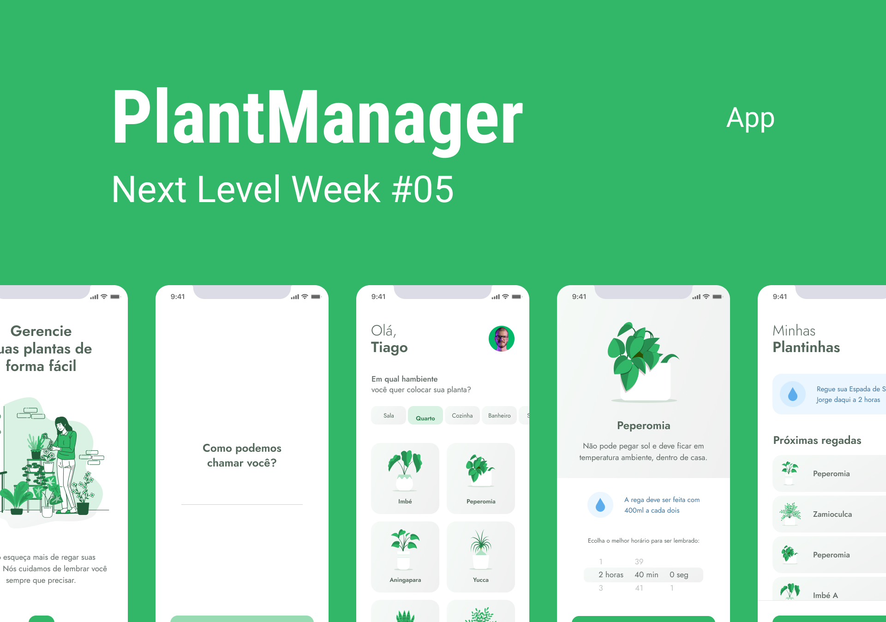
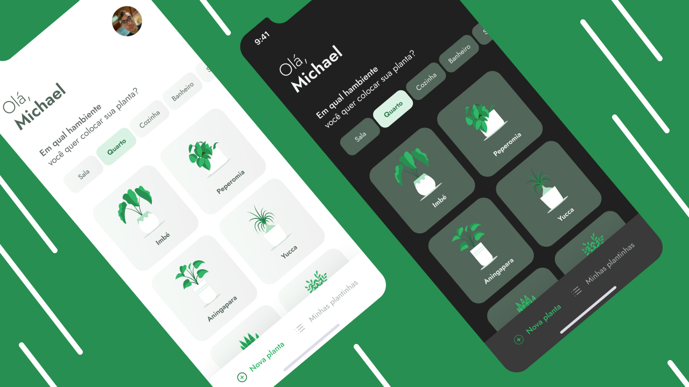

<h1 align="center">
    
</h1>

<p align="center">
  <a href="#-tecnologias">Tecnologias</a>&nbsp;&nbsp;&nbsp;|&nbsp;&nbsp;&nbsp;
  <a href="#-instalação">Instalação</a>&nbsp;&nbsp;&nbsp;|&nbsp;&nbsp;&nbsp;
  <a href="#-sobre-o-projeto">Sobre o Projeto</a>&nbsp;&nbsp;&nbsp;|&nbsp;&nbsp;&nbsp;
  <a href="#-layout">Layout</a>&nbsp;&nbsp;&nbsp;|&nbsp;&nbsp;&nbsp;
  <a href="#-licença">Licença</a>
</p>

<br>

<p align="center">
  
</p>

---

## 🧪 Tecnologias

Este projeto foi desenvolvido com as seguintes tecnologias:

- [React Native](https://reactnative.dev/)
- [Expo](https://expo.io/)
- [TypeScript](https://www.typescriptlang.org/)

## 🚀 Instalação

Clone este repositório para acessar o projeto

```bash
$ git clone https://github.com/michaeldnf/plantmanager.git && cd plantmanager
```

Seguir os seguintes passos
```bash
# Instalando as dependências
$ yarn install

# Inicie o projeto
$ expo start
```

## 💻 Sobre o projeto

App para nos lembrar de sempre regar as nossas plantinhas de casa 🌱

Este projeto foi desenvolido durante a **[Next Level Week](https://nextlevelweek.com/)**, apresentado pela **[@Rocketseat](https://github.com/Rocketseat)** durante os dias 19 a 20 de abril de 2021.

## 📚 Milha Extra
Segue algumas coisas feitas e adicionadas por mim: 
  - Agora temos dark mode inserido no App;
  - Na execução do App é feito um request para permitir as notificações no dispositivo.



## 🔖 Layout

Para acessar o layout do projeto, segue o link do Figma:

- [Layout](https://www.figma.com/file/NnJD2vgqw82MPVI8ExrO7Q/PlantManager) 

Lembrando que é necessario ter conta no [Figma](http://figma.com/) para acessar o layout.

## 📝 Licença

Este projeto possui licença MIT. Confira o arquivo [LICENSE](LICENSE.md) para mais detalhes.
